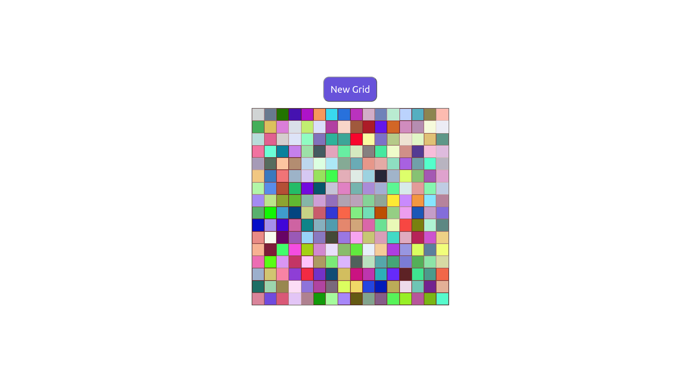

# Etch A Sketch  - The Odin Project

This is a browser-based Etch-A-Sketch application created as part of The Odin Project's Foundations curriculum. It's a classic digital drawing pad that allows users to create pixel art by hovering their mouse over a dynamic grid.

***

## Screenshot

## Live Demo

Check it out here: https://laym00n.github.io/odin-etch-a-sketch/

## Technologies Used

* HTML5: For the basic structure and a <button>.

* CSS3: For styling, centering, and creating the grid layout.

    * Flexbox

    * box-sizing: border-box

* JavaScript (ES6+): For all the logic.

    * document.createElement

    * element.classList

    * element.appendChild

    * element.addEventListener (click and mouseover)

    * prompt() for user input

    * Math.random()

    * parseFloat()

    * Dynamic style manipulation (element.style)